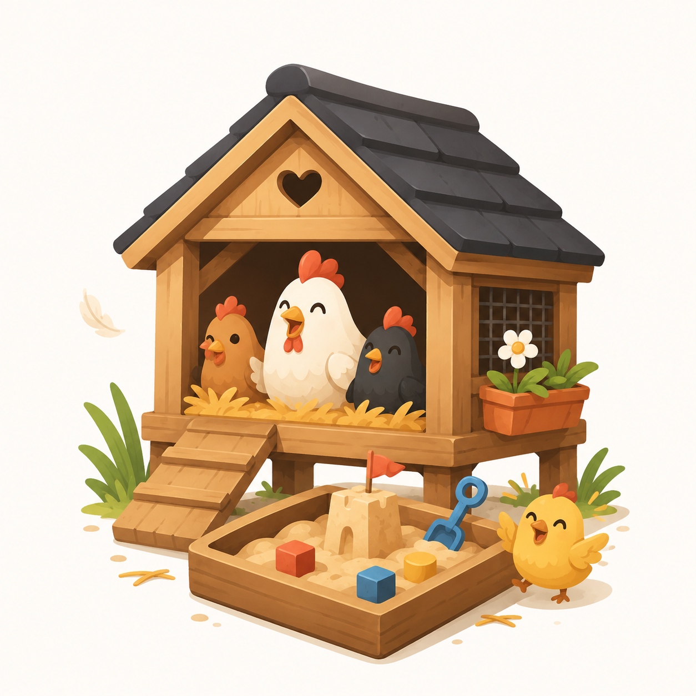

<div align="center">

# co:op



**Run a coding agent on your real repos every day — in a box it can't escape, with your secrets out of its reach, and with a whip that will make them work all night.**

[](https://github.com/AndrewDryga/coop/actions/workflows/ci.yml)
[](https://github.com/AndrewDryga/coop/releases/latest)
[](https://goreportcard.com/report/github.com/AndrewDryga/coop)
[](LICENSE)

</div>

Coding agents are most useful with the brakes off (`--dangerously-skip-permissions`,
`--yolo`) — and that's exactly when you don't want them loose on your laptop.
Coop runs them in a disposable container that mounts only the repo you're working
on, shadows its secrets, and can't reach your home dir, SSH keys, or other projects.
One command, installed once; the same box drives Claude, Codex, and Gemini.

```bash
cd ~/code/some-repo && coop claude     # a sandboxed Claude, brakes off, secrets hidden
```

> **📖 New here? Start at [coop.dryga.com](https://coop.dryga.com)** — the friendly guide, with
> the *why* behind each feature, walkthroughs, and live terminal demos. This README is the
> quick reference; the site is the readable docs.

It's the working tooling behind two write-ups:
[Running an AI coding agent you can't trust](https://dryga.com/blog/untrusted-ai-coding-agent/)
(the sandbox) and [One brain, two agents](https://dryga.com/blog/os-for-coding-agents/)
(the queue, hooks, and the foreman that runs it unattended).

---

## Contents

- [Install](#install) · [Quickstart](#quickstart) · [Command reference](#command-reference)
- [The sandbox](#the-sandbox) — what's mounted · secrets shadowed · git identity · `coop doctor`
- [Forks](#forks-hand-off-work-like-a-pr) — open · review · land work like a contractor's PR
- [Agents & config](#agents--config) — authentication · credentials · models · presets · instructions · MCP servers
- [Fusion](#fusion-a-governed-council) — a council of models that argues before it commits
- [Drive it from Zed (ACP)](#drive-it-from-zed-acp)
- [Run it unattended](#run-it-unattended) — the loop · the `.agent/` folder · monorepos · a fleet
- [Project toolchain & services](#project-toolchain--services) — `.tool-versions` · `Dockerfile.agent` · services · dev-server ports
- [Configuration](#configuration) · [Troubleshooting](#troubleshooting) · [Layout & development](#layout--development)

---

## Install

```bash
curl -fsSL https://raw.githubusercontent.com/AndrewDryga/coop/main/install.sh | sh
```

Downloads the prebuilt `coop` binary for your OS/arch into `~/.local/bin` — no Go, no
clone. If a container runtime is present, the installer also builds the sandbox image
and runs `coop doctor`; otherwise do that once yourself:

```bash
coop build && coop doctor
```

**Requirements:** a container runtime — Apple
[`container`](https://github.com/apple/container) (macOS 26+), Docker, or Podman,
auto-detected. `coop` itself is a single static binary with no other dependencies.

**Staying current:** [`coop update`](#keeping-the-box-current) self-updates the binary
*and* rebuilds the box image fresh, pulling the latest agent CLIs and ACP adapters
(they ship features often) plus a newer base. (Re-running the install one-liner still works.)

<details><summary><b>Other ways to install</b></summary>

```bash
git clone https://github.com/AndrewDryga/coop && cd coop && make install   # from source
```
</details>

<details><summary><b>Verifying a download</b></summary>

`install.sh` verifies automatically: when [cosign](https://github.com/sigstore/cosign)
is on your `PATH` it checks `checksums.txt`'s keyless Sigstore signature (so the
checksum file itself is trusted, not just internally consistent) and aborts on failure;
otherwise it compares the archive's SHA-256 and prints that the signature was not
verified. To verify by hand, set `VER` and `ASSET` for your platform — e.g.
`VER=v0.1.0 ASSET=coop_0.1.0_darwin_arm64.tar.gz`:

```bash
base="https://github.com/AndrewDryga/coop/releases/download/$VER"
curl -fsSLO "$base/$ASSET"
curl -fsSLO "$base/checksums.txt"
curl -fsSLO "$base/checksums.txt.bundle"

# 1. checksums.txt is signed by the release workflow (keyless Sigstore):
cosign verify-blob checksums.txt \
  --bundle checksums.txt.bundle \
  --certificate-identity-regexp '^https://github.com/AndrewDryga/coop/' \
  --certificate-oidc-issuer https://token.actions.githubusercontent.com

# 2. the archive matches the now-trusted checksum (Linux: sha256sum -c -):
awk -v f="$ASSET" '$2==f{print $1"  "f}' checksums.txt | shasum -a 256 -c -
```
</details>

## Quickstart

From nothing to disposable agents draining a task queue, sandboxed:

```bash
curl -fsSL https://raw.githubusercontent.com/AndrewDryga/coop/main/install.sh | sh
# ^ installs the binary, and (if a runtime is present) builds the box + runs coop doctor

cd ~/code/your-repo        # 1. any git repo
coop init                  # 2. scaffold AGENTS.md, the .agent/ queue, and the hooks
coop login claude          # 3. authenticate once (paste-code, no browser; token persists)
coop doctor                # 4. prove isolation holds (run 'coop build' first if needed)

# 5. queue a few tasks (a folder each under .agent/tasks/00_todo/)…
coop tasks add "Add a /health endpoint"
coop tasks add "Backfill tests for the parser"
coop tasks add "Document the config file"

coop loop                  # 6. disposable agents work the queue until done, then audit
```

Prefer to steer an agent yourself? Skip the queue and go interactive:

```bash
coop claude           # sandboxed Claude — no permission prompts, secrets shadowed
coop codex            # same box, Codex instead
coop gemini           # ...or Gemini
coop fusion           # a council: one model leads, the other two advise, then it synthesizes
coop shell            # a shell in the box, to look around
coop run -- npm test  # run any command in the box
```

Point it at a repo and go. Each agent launches with its own "don't stop to ask" flags
(`--dangerously-skip-permissions`, `--dangerously-bypass-approvals-and-sandbox`,
`--yolo`), all inside the same sandbox. The worst an off-the-rails agent can do is
trash one repo you can restore from git.

Anything after the agent name is passed through to it, on top of those flags — so
`coop claude --continue` resumes Claude's last session, still sandboxed. (Codex is the
exception: its `-p` is `--profile`, not a prompt, so run a one-shot prompt with
`coop codex exec "…"` and use `-p` only to pick a profile.)

If `coop doctor` says the image isn't built, run `coop build` once. Stuck on any step?
See [Troubleshooting](#troubleshooting). New to forks and reviewing agent work like a
PR? Jump to [Forks](#forks-hand-off-work-like-a-pr).

## Command reference

Every command runs against the repo in your current directory. `-h`/`--help` works on
any of them.

The groups below match `coop help` — same commands in each, with more of the flags
spelled out here (there's room to render them).

**Agents**

| Command | What it does |
|---|---|
| `coop claude` · `codex` · `gemini` `[args]` | a sandboxed agent — its autonomous flags, plus any args you add |
| `coop fusion [agent]` | a [governed council](#fusion-a-governed-council): that agent leads, the other two advise |
| `coop acp [agent\|fusion] [--credential <name>] [--model <model>] [--consult]` | run as an [ACP](#drive-it-from-zed-acp) agent over stdio (for Zed) — coop owns the toolbar (credential/preset switch, yolo) and rides out box restarts and rate limits for you; pin a per-entry credential/model, `--consult` lets it ask the peers read-only |
| `coop <agent> --consult` | [opt-in second opinion](#second-opinions---consult) — may ask authed peers on hard calls |
| `coop <agent> --model <model>` | [pick the model](#picking-models) for that run — works on agent runs, fusion, forks, the loop, and acp |

**Credentials, models & presets** ([details](#agents--config))

| Command | What it does |
|---|---|
| `coop login <agent> [--credential <name>]` | [authenticate](#authentication) an agent (token persists in the config dir); `--credential` adds a second account |
| `coop credentials [agent [credential]]` | list stored credentials + which are signed in; a path grammar edits one (e.g. `coop credentials claude work default` · `… rm`) |
| `coop models [agent]` | the model menu per agent ([picking models](#picking-models)) — set a model with `--model` or a [preset](#presets-the-whole-arrangement-in-one-yaml-file) |
| `coop presets [name]` | list [orchestration presets](#presets-the-whole-arrangement-in-one-yaml-file) (lead + roles) or show one; `coop presets init` scaffolds the frontier recipe |

**The box**

| Command | What it does |
|---|---|
| `coop run -- <cmd>` | run any command in the box (raw — none of coop's agent flags) |
| `coop shell` | a shell in the box, to look around |

**Forks** — hand off work like a PR ([details](#forks-hand-off-work-like-a-pr))

| Command | What it does |
|---|---|
| `coop fork <name> [agent] [--new]` | open or re-enter a [secrets-free fork](#forks-hand-off-work-like-a-pr) + run an agent (re-entry resumes the session; `--new` resets) |
| `coop fork ls` | list this repo's forks: agent, branch, state, tasks done/total, change size, last activity |
| `coop fork review <name> [--stat\|--tool]` | dossier + diff; `--stat` = dossier only, `--tool` = your `git difftool` |
| `coop fork merge <name> [--all] [--yes]` | rebase the fork onto your branch and land it (`--all` = the whole fleet; `--yes` confirms non-interactively) |
| `coop fork logs [name] [-f]` · `stop <name>` | tail a loop log (no name = all) · stop a detached loop |
| `coop fork rm <name> [--force] [--yes]` | discard a fork — confirms first (`--yes` skips it; refuses unmerged/dirty work without `--force`) |
| `coop fork open <name>` · `path <name>` | open the fork in your editor · print its filesystem path |
| `coop fork <name> <agent> --loop [--tasks <path>] [-d]` | loop a tasks queue unattended in the fork (`-d` detaches) |
| `coop fork <name> acp [agent]` | drive the fork's [sandboxed agent from Zed](#drive-it-from-zed-acp) over ACP |

**Unattended** ([details](#run-it-unattended))

| Command | What it does |
|---|---|
| `coop loop [agent] [--tasks <path>] [--model <model>] [--preset <name>] [--consult] [--preflight] [--debug-on-fail]` | work the [`.agent/tasks/`](#the-loop) queue until done, then audit (`claude` default; `codex`/`gemini` too); `--tasks` picks the queue (default `.agent/tasks`, repeatable); `--model`/`--preset` set the [rotation](#picking-models); `--consult` lets iterations ask the [peers](#the-orchestrator-pattern) read-only; `--preflight` tidies `.agent/` state first; `--debug-on-fail` opens a box shell on a failure |
| `coop fleet init` · `up` · `down` · `split <n>` · `watch` · `prune` | scaffold then drive a [declared fleet](#a-fleet) from `.agent/fleet.yaml` (`init` writes a documented template; `watch` is the live board; `prune` clears merged forks) |

**Tasks** — a folder-per-task queue in `.agent/tasks/` ([details](#the-loop))

| Command | What it does |
|---|---|
| `coop tasks ls` | show the queue, grouped by state (a folder per task; its directory *is* its state) |
| `coop tasks watch` | live board of the queue + any active forks, merged and deduped by id (auto-exits when every task's done; Ctrl-C anytime) |
| `coop tasks add "<title>"` · `claim` · `block` · `unblock` · `done` · `rm` | move one task through its states (moving its folder is the state change) |
| `coop tasks decisions [-i]` · `lint` · `split <n>` | what's blocked on a decision (`-i` to answer) · check the tree · carve todo tasks into per-fork slices |
| `coop backlog` · `add "<title>"` · `promote <id>` · `rm <id>` | park unscheduled ideas in the `xx_backlog/` drawer — same folder format, but outside the lifecycle (never auto-worked, never nagged); `promote` moves one into `00_todo/` when it's ready |

**Services** — the box's `compose.agent.yml` sidecars ([details](#services))

| Command | What it does |
|---|---|
| `coop up` · `down [-v]` | start/stop [sibling services](#services) (Postgres, Redis) for this repo |

**Safety** — prove the box holds, catch committed secrets

| Command | What it does |
|---|---|
| `coop doctor` | [prove isolation](#prove-it-coop-doctor) — attack the box and check it holds |
| `coop check-secrets [--include-ignored]` | scan committed files for secrets by content — `--include-ignored` widens to the [whole visible tree](#secrets-never-enter-the-box) (exit 1 on a hit) |

**Set up & maintain**

| Command | What it does |
|---|---|
| `coop init [--stack asdf]` | [scaffold](#project-toolchain--services) the queue, hooks, skills, and [starter subagents](#the-orchestrator-pattern) (and optionally a toolchain) |
| `coop build` · `update` | build the box image · [self-update coop + rebuild it fresh](#keeping-the-box-current) (latest agents/adapters) |
| `coop completion <shell>` | shell tab-completion (bash, zsh) |
| `coop help` · `version` | print help · print the version |

## The sandbox

The repo is bind-mounted into the box at the same path it has on your machine, so
the agent edits real files and you see them live in your editor. Everything else —
your home dir, SSH keys, the rest of the disk — simply isn't in the container.

### Secrets never enter the box

`.env`, `*.tfvars`, `*.pem`, `secrets/`, `.ssh`, and friends are shadowed: an empty
`tmpfs` over secret directories, a read-only empty file over secret files. Templates
(`*.example`, `*.sample`, `*.template`) stay visible. The defaults are compiled in
(`internal/box/secrets.go`); add a `.coopignore` at the repo root for your own:

```gitignore
prod.yml                 # basename — matched at any depth
config/credentials.yaml  # a slash makes it a repo-relative path
vault/                   # a directory — its contents are hidden whole
```

**The boundary is `.coopignore`, not `.gitignore`.** A normal `coop run`/`loop`/`shell`
binds your *whole* working tree, so a gitignored-but-present file (e.g. a
`serviceAccount.json`) is **fully visible** to the agent — shadow it with `.coopignore`.
For a token hiding *inside* a file, `coop check-secrets` scans by content (`file:line`,
exit 1 on a hit); `--include-ignored` widens it to the whole visible tree. Prove your
setup holds with [`coop doctor`](#prove-it-coop-doctor).

> Full walkthrough — subdirectory scoping, template re-hiding, the fork exception:
> [**coop.dryga.com/docs.html#secrets**](https://coop.dryga.com/docs.html#secrets).

### Your git identity, not the box's

The box has no `~/.gitconfig` of its own, so coop mounts a curated one into every run:
your global `user.name`/`user.email` (commits are authored as you), your global
gitignore (`core.excludesfile`), and `commit.gpgsign=false` — the box holds no
signing key, so without that a global `gpgsign=true` would fail every commit. Your key
never enters the box; commits made inside it are unsigned. (Forks can still land
signed — see [Landing](#land-it-rebase-gate-sign).)

### Prove it: `coop doctor`

```bash
coop doctor
```

`doctor` plants a fake secret, launches the box, and checks from inside that the
secret is unreachable and unwritable — then checks on the host that a fork carries
neither the secret nor a pushable remote. Run it anytime, especially after changing
config.

## Forks: hand off work like a PR

A fork is a throwaway local clone of your repo, handed to an agent instead of your
working tree. It's an extra layer of isolation (the agent never touches your checkout)
and the unit of parallelism (run several at once). Because a fork's `origin` is a local
path, the agent has nowhere to push — and gitignored secrets were never committed,
so they don't come along. You stay the reviewer and the only one who lands anything.

The lifecycle mirrors a contractor's PR: open → work → review → land.

```bash
coop fork perf codex     # open: clone into ../<repo>-forks/perf, run codex there
coop fork perf           # re-enter: continues codex's last session by default
coop fork ls             # list your forks (branch, changes, state, last activity)
coop fork review perf    # review: the dossier, then the diff
coop fork merge perf     # land: rebase onto your branch, then close the fork
coop fork rm perf        # or discard it (confirms first; refuses unmerged/dirty work without --force)
```

`coop fork <name>` opens a new fork or re-enters an existing one. The agent defaults
to `claude`; pass `codex` or `gemini` to pick
the model. A fork inherits your git identity, signing key, and global gitignore from
the parent — so the agent can commit *as you* and ignores the same noise you do.

**Loop one unattended.** Point a fork at a task queue and it works it on its own:

```bash
coop fork api codex --loop -d   # loops the repo's task queue(s); -d detaches — tail with coop fork logs api -f
```

See [the loop](#the-loop) for how iterations work, and [a fleet](#a-fleet) to run several at once.

### Re-entry resumes the session

A fork remembers the agent it was created with, so `coop fork perf` after
`coop fork perf codex` re-enters with *codex*, not a silent fallback to claude (pass an
agent to switch; `coop fork ls` shows each fork's agent). The agent's session history
persists too, so re-entry continues its last conversation instead of starting fresh.
For claude and gemini, coop assigns each fork its own session id (kept in the fork's
git-excluded `.coop/`) and resumes exactly that one — so a loop or a peer consult that
shares the fork's directory can never hijack the "continue". codex can't be handed an
id, so it resumes the most-recent *interactive* session recorded for the fork (skipping
`codex exec` loop/consult runs). It falls back to a fresh session when none exists.
Force one with `--new`; `--fresh` recreates the whole fork (refusing to discard unmerged/dirty
work without `--force`).

### Review — in your terminal or your IDE

`coop fork review <name>` opens with a dossier that maps the risk before the patch:
the commits; the agent's claim (the latest task `log.md`, labeled — it's the fork's own
voice); policy findings from the same scan `coop fork merge` enforces, so nothing first
surfaces as a failed merge; the changed files risk-ordered (config & instructions, then
code by churn, then tests, then docs, each with `+N -N`); and whether a merge gate is
configured. Then the diff shows in your pager. No setup needed. To review in an IDE
instead:

| | |
|---|---|
| `--stat` | dossier only, skip the diff |
| `--tool` | open each changed file in your GUI difftool |

To review in your editor's SCM panel instead, open the fork as a folder with `coop fork
open <name>` (it uses the editor resolution below).

<details>
<summary><b><code>coop fork open</code></b> — which editor it opens</summary>

It opens the fork directory with the first of these that's set:

1. `COOP_EDITOR` — a coop-only override
2. `git config core.editor` — your normal git editor (local config beats global)
3. an auto-detected GUI editor on `PATH`: `cursor`, `code`, `zed`, `idea`, `subl`
4. `$VISUAL` / `$EDITOR`

Detection (step 3) is just a best-effort fallback — with both `code` and `zed`
installed it picks `code`. To choose, set one of the first two:

```bash
git config --global core.editor "zed --wait"   # your standard git editor (git commit uses it too)
export COOP_EDITOR="zed"                        # coop-only; overrides core.editor
```

coop runs the editor command verbatim, so `core.editor = "zed --wait"` blocks the
terminal until you close the window — that's what `--wait` is for. If you'd rather the
command return immediately, set `COOP_EDITOR` without `--wait` (e.g. `COOP_EDITOR=zed`).
</details>

<details>
<summary><b><code>--tool</code></b> — register your difftool</summary>

`--tool` runs `git difftool`, which opens each changed file in whatever
`git config diff.tool` points at. Register one once:

```bash
# VS Code
git config --global diff.tool vscode
git config --global difftool.vscode.cmd 'code --wait --diff "$LOCAL" "$REMOTE"'

# Zed
git config --global diff.tool zed
git config --global difftool.zed.cmd 'zed --wait --diff "$LOCAL" "$REMOTE"'
```

JetBrains, Meld, Beyond Compare, vimdiff, etc. work the same way — see
`git difftool --tool-help` for the tools git already knows.
</details>

<details>
<summary><b><code>COOP_REVIEW_CMD</code></b> — wire any tool</summary>

For full control, set `COOP_REVIEW_CMD`. coop runs it via `sh -c` from the parent repo
with `$COOP_FORK_PATH`, `$COOP_FORK_NAME`, and `$COOP_REVIEW_REF` in the environment, so
you can launch a TUI, a script, anything:

```bash
export COOP_REVIEW_CMD='cd "$COOP_FORK_PATH" && lazygit'
```
</details>

### Land it: rebase, gate, sign

`coop fork merge <name>` rebases the fork onto your current branch and
fast-forwards — linear history, no merge commits. The rebase happens on the host, where
your key lives, so if you sign commits (`commit.gpgsign=true`) the landed commits are
signed with your key even though the box committed them unsigned. Then `git push` —
the only step the agents can't do.

Set `COOP_GATE` (e.g. `COOP_GATE="make check"`) and every merge re-runs that gate in
the box on the *rebased* tree, rolling back if it goes red — the machine gate behind
your human review. A policy check also flags secret-looking or oversized files and
scans each changed file's content for real credentials (provider token shapes —
AWS/OpenAI/Anthropic/GitHub/Slack/… — plus high-entropy values on secret-named keys), so
a token committed inside an ordinary file is caught even though its filename is innocuous
(override with `--force`). Merge refuses if your own tree is dirty.

Merging lands work and then offers to delete the fork, so it asks first. In a
non-interactive shell (CI, a pipe) there's no one to answer, and merge refuses
rather than landing on the default — pass `--yes` (`-y`) to confirm landing and
removal up front. `--yes` also skips the prompts interactively.

Merging lands code, not queue state. A fork's loop works a *copy* of the task queue
(`.agent/` is gitignored, seeded when the fork is created), so after a merge the parent's
`.agent/tasks/00_todo/` still lists the tasks the fork finished. Mark them done or remove
them — `coop tasks done <id>` / `coop tasks rm <id>` — so a later `coop loop` doesn't
re-claim finished work (redoing a done task makes an empty commit, which fails). While forks
run, `coop tasks watch` shows the deduped truth across the parent and its forks.

## Agents & config

One box, three agents. Each reads its config and credentials from
`~/.config/coop/agents/<name>/`, mounted into the box at `~/.claude`, `~/.codex`, and
`~/.gemini`. That directory lives outside any repo, so credentials never land in git —
edit those files on the host and they take effect in the box. Only the *active* credential
is mounted, so a running agent sees just the account it's using, not the whole vault.

Each run mounts only the **launched agent's** credentials: `coop claude` mounts
`~/.claude` (and that agent's API key from the env file), never the Codex or Gemini ones.
The exceptions are the modes where the lead is explicitly told to call its peers —
`coop fusion` and `coop <agent> --consult` (and forks) — which also mount the
*authenticated* peers so they can be consulted read-only. Raw runs (`coop run`,
`coop shell`) and maintenance runs (the merge gate, `coop doctor`) mount no agent
credentials at all. `coop login <agent>` mounts only the agent being signed in.

> **Blast radius.** That credential dir is mounted read-write — the agent must write its
> session history, and OAuth refresh rewrites the token in place. So a prompt-injected
> agent can (a) read its own credentials and try to exfiltrate them — set
> `COOP_EGRESS=none` to cut the box off the network — and (b) write config its CLI
> auto-loads next launch (e.g. a `settings.json` hook), which then runs in future boxes
> for that credential. (b) stays *inside* the container — not a host escape — but it's a
> durable foothold. A fuller fix (copy credentials into an ephemeral in-box location,
> persist nothing host-side) is planned; for now, `COOP_EGRESS=none` covers the exfil half.

### Authentication

```bash
coop login claude     # interactive login; the token persists in agents/claude/
coop login codex      # device-code login (the box has no browser for an OAuth redirect)
coop login gemini     # or it logs in on first use
```

…or use API keys — drop them in the env file, passed into every box:

```bash
echo 'ANTHROPIC_API_KEY=sk-…'  >> ~/.config/coop/agents/env
echo 'GEMINI_API_KEY=AIza…'    >> ~/.config/coop/agents/env
```

A run only sees the API keys of the agents in its credential scope (above): a `coop
claude` box gets `ANTHROPIC_API_KEY` but not `OPENAI_API_KEY` / `GEMINI_API_KEY`, which
are filtered out before the env file is passed in. Any other variable in the file (a
`DATABASE_URL`, `COOP_NO_ASDF`, …) is a shared runtime var and reaches every box.

On first run the box pre-answers each agent's setup prompts — Claude's
theme/folder-trust/bypass warnings, Codex's "trust this directory?", and Gemini's
folder-trust — so a fresh install goes straight from login to work. (The box is the
sandbox, so trusting the one mounted repo is the intended posture.)

### Multiple subscriptions, with failover

One agent can hold several accounts as named **credentials** — each a stored login and
its own rate-limit pool — so a long unattended run can ride through a subscription's cap
instead of parking on it (`coop profiles` was the pre-v3 name for the same thing):

```bash
coop login claude --credential work       # a second account…
coop login claude --credential personal   # …and a third
coop credentials                          # list them and which are signed in
```

When `coop loop` (or a `coop fork --loop`) hits a rate/usage limit it switches to the
next target and keeps going, only waiting once every target is limited. A [Zed (ACP)
session](#drive-it-from-zed-acp) does the same transparently — rotate, re-send your
prompt, move the toolbar dropdown; or wait for the nearest reset when every account is
cooling. There is no persistent pool to configure: the rotation *is* the model-first
`models:` ladder of the loop's lead. With no preset it rotates the agent's default model across every signed-in
account; a bare model in a ladder does the same, while a pinned `model@account` runs just
one. Limits are tracked per (model, account), so `claude-opus-4-8@personal` stays usable
while `claude-opus-4-8@work` cools down. A ladder gives you **fallbacks** in the order you
write them — step to a cheaper model, another account, or both:

```yaml
# .agent/presets/frontier/preset.yaml — coop presets init scaffolds this
lead:
  agent: claude
  models: [claude-opus-4-8, claude-fable-5@work]  # opus on all accounts, then fable on work
```

```bash
coop loop --preset frontier    # rotates that ladder; coop presets shows every recipe
coop loop --model opus@work    # or a one-off single target, no preset
```

Which credential a plain interactive `coop claude` uses is a mark you set, not a magic
name — so you can name them all meaningfully. Credential properties are edited as a path
(`coop credentials <agent> <credential> <attribute> [value]`):

```bash
coop credentials claude personal default  # `coop claude` now runs on the personal account
```

Credentials live in the vault (`~/.config/coop/agents/<agent>/profiles/<name>/`), never in
the repo, and only the active one is mounted into the box — so a running agent sees just
the account it's using, not your whole vault. Switching accounts loses no work: each loop
iteration is a fresh run, and the queue plus git carry the progress.

### Picking models

Every launch takes `--model` — pick the model per run, on any path:

```bash
coop claude --model opus               # one big-model interactive session
coop fusion claude --model fable       # the governor's model (peers keep their own)
coop loop --model haiku                # a cheap overnight grind
coop fork risky claude --model opus    # a careful fork on the big model
coop acp claude --model sonnet         # pin an editor entry's model
```

For a *standing* model you don't retype, put it in a
[preset](#presets-the-whole-arrangement-in-one-yaml-file): the lead's `models:` ladder is
the model (and, on a loop, the rotation across your accounts), and each role names its own.
Pick the model with `--model` or a preset — a credential is just an account (which
subscription); the model is a separate axis:

```bash
coop models                        # the model menu per agent
coop claude --model opus           # one run on the big model
coop claude --preset frontier      # a standing lead model + roles, from the preset
```

Two env knobs round it out: `COOP_<AGENT>_MODEL` (e.g. `COOP_CLAUDE_MODEL=fable`) is the
agent-wide default, and `COOP_LOOP_MODEL` applies to loop iterations only — so unattended
runs can grind on a cheaper model than your interactive sessions. In a fleet, give a fork
its own with `model:` in `.agent/fleet.yaml`. Precedence, most specific first: `--model` ›
the preset ladder's active entry › `COOP_LOOP_MODEL` (loop runs) › `COOP_<AGENT>_MODEL` › a
model baked into `COOP_<AGENT>_CMD` › the agent CLI's own default.

The chosen model reaches consult peers and fusion advisors too (each peer resolves its
own default), and `coop loop`'s live view prints the model each iteration actually ran —
the agent's own init report, so it's ground truth, not coop's guess. coop never validates
a model id: `coop models` shows *examples*, ids churn, and whatever the agent CLI accepts
works — a bad one fails loudly in the agent's own error. (One gap: codex under ACP reads
its model from its own `config.toml`; its adapter takes no flags and codex has no model
env var.)

### The orchestrator pattern

Put your strongest model in charge and let it spend the cheap tokens: the lead plans,
decomposes, and synthesizes, while pinned subagents execute and cross-vendor peers give
independent opinions. Everything below composes from pieces coop already has — no plugins.

```bash
coop claude --consult --model claude-fable-5   # run it; --consult mounts the peers
```

For a *standing* arrangement (a lead model + its roles you don't retype), put it in a
[preset](#presets-the-whole-arrangement-in-one-yaml-file) and run `coop claude --preset <name>`.

- **Tiered subagents** — `coop init` scaffolds `.claude/agents/deep-reasoner.md` (pinned
  to Opus: architecture, complex debugging, algorithm design) and `fast-worker.md`
  (pinned to Sonnet: boilerplate, tests, mechanical edits). They're native Claude Code
  subagents: the lead auto-delegates on their descriptions, each turn bills at *its*
  model, and the lead's context stays lean. Commit them; edit them freely.
- **Peer engineers, not reviewers** — with `--consult` (or fusion), the lead can ask
  codex and gemini read-only via `coop-consult <peer>`: different training, different
  blind spots. **The `--consult` flag matters** — a plain `coop claude` deliberately
  doesn't mount peer credentials, so peers only answer in a consult/fusion box.
- **High-stakes calls** — task deep-reasoner *and* a peer on the same problem in
  parallel, without showing either the other's answer, then synthesize. (This is the
  move coop's fusion directive already teaches its governor.)

The same arrangement runs unattended: `coop loop --model claude-fable-5 --consult`
makes every iteration orchestrate this way — the pinned subagents ride along in the
repo, and `--consult` mounts the peers into each iteration's box (fork loops take it
too: `coop fork <name> claude --loop --consult`, and a fleet fork opts in with
`consult: true`). Prefer `coop-consult` over vendor cross-agent plugins in the box:
nothing to install, peers stay read-only (one writer per tree), and the credential
scoping is already handled.

### Presets: the whole arrangement in one YAML file

The orchestrator pattern above is assembled by hand — a `--model` here, a `--consult`
there. A **preset** declares the whole arrangement once, as a runtime recipe under
`.agent/presets/<name>/`: who leads, and which **roles** it routes work to. Three role
modes cover the spectrum: `native` (a Claude subagent inside the lead's session),
`consult` (a read-only peer via `coop-consult`), and `delegate` (a **write-capable**
delegate via `coop-delegate`). `.agent/presets/frontier/preset.yaml`:

```yaml
lead:
  agent: claude
  # models is the lead's fallback ladder (model-first). A bare model runs on EVERY
  # signed-in account (rotating on rate limit); model@account pins one. On a loop it
  # rotates top-to-bottom; a single run uses the first.
  models: [claude-fable-5, claude-opus-4-8@work]
  prompt: roles/lead.md        # optional Markdown, appended to the generated contract

roles:
  thinker:                     # deep thinking + review, in the lead's own session
    mode: native
    agent: claude
    model: claude-opus-4-8     # coop generates a coop-thinker subagent from this role
    when: [architecture, debugging, code-review, before-commit]
    prompt: roles/thinker.md   # its system prompt (or set subagent: <name> to reuse one)

  critic:                      # independent critique from another vendor, read-only
    mode: consult
    agent: codex
    model: gpt-5.5             # a role runs on its agent's default account
    when: [plan-review, security, tradeoffs]

  fast:                        # cheap mechanical work, write-capable
    mode: delegate
    agent: gemini
    model: gemini-3.5-flash
    when: [boilerplate, bulk-edits, test-scaffolding, repo-survey]
    commit: never              # it edits; the LEAD reviews the diff, gates, commits
    concurrent: never          # delegate runs are serialized
```

Run anything under it — the preset's lead is the default agent, and an explicit
agent/`--model`/`--credential` still wins:

```bash
coop presets init                # scaffold the recipe + starter prompt files, ready to edit
coop claude --preset frontier    # interactive lead with the full routing contract
coop loop --preset frontier      # unattended: lead credentials rotate, roles ride along
coop fusion --preset frontier    # council + the preset's roles
```

Presets resolve from **two locations, repo wins**: the repo's `.agent/presets/<name>/`
first, then a per-user global dir `~/.config/coop/presets/` (`COOP_PRESETS_DIR` overrides
it) — so a recipe like `frontier` applies across every repo without symlinking. A repo
preset shadows a same-named global one (no merging); `coop presets` tags a global-sourced
one `(global)`. `coop presets init` scaffolds into the repo; author a global preset by hand.

coop generates the lead's routing contract from the YAML — each role, when to use it,
and its role-addressed invocation (`@coop-thinker`, `coop-consult critic --fresh "…"`, or a
`coop-delegate fast <<'EOF' … EOF` heredoc) — and mounts the wrappers. A **native** role
generates its Claude subagent in the box — `coop-<role>`, from the role's model + `when` +
prompt, never written to your repo (`.gitignore` keeps the overlay out of commits); set
`subagent: <name>` to reference an existing `.claude/agents/` subagent instead. A **consult**
role runs its agent on the role's model, and the role's prompt (if any) is the persona the
peer adopts — so two consult roles on one agent stay distinct. Native roles run inside the
lead's session, so under a `codex`/`gemini` lead they **degrade to exactly such a consult** —
same model and persona, `coop-consult <role>` instead of in-session — so a non-Claude lead
still gets Claude's deep reasoning.
`coop presets init` scaffolds starter `roles/lead.md`, `roles/thinker.md`, and `roles/fast.md` (usable
defaults, not placeholders); their Markdown feeds the generated text — never replacing the
safety/routing rules — and you edit or delete them freely.

`coop-delegate` is the write-capable counterpart of the read-only `coop-consult`: the
delegate may edit the shared worktree, runs are serialized, and it must **not** commit —
the wrapper compares `HEAD` before and after and fails loud if the delegate committed.
The lead then reviews `git diff`, runs the gate, fixes or reverts what falls short, and
makes the commit itself. That keeps one reviewer — your strongest model — accountable
for everything that lands, while the cheap tokens do the typing.

### Instructions, one source of truth

`coop init` wires a tool-neutral setup so every agent reads the same instructions:
`CLAUDE.md` and `GEMINI.md` symlink to a canonical `AGENTS.md`, and Codex shares
Claude's skills directory. A real (non-symlink) instruction file you already have is
left untouched. A shared `~/.config/coop/agents/INSTRUCTIONS.md` is also wired into each
agent's global instruction path.

### MCP servers, defined once

`coop init` seeds an empty `~/.config/coop/agents/mcp.json` (the standard
`{ "mcpServers": { ... } }` shape). An empty one wires up nothing, so drop your servers
in and all three agents pick them up:

```bash
$EDITOR ~/.config/coop/agents/mcp.json                      # the stub coop init wrote
cp agents/mcp.json.example ~/.config/coop/agents/mcp.json   # …or start from the example
```

`coop` wires that one file into each agent's native mechanism on launch: Claude via
`--mcp-config`, Gemini merged into its `settings.json`, Codex converted to
`[mcp_servers.*]` in its `config.toml`. The Gemini/Codex versions are generated
read-only on top of your existing config (pure Go, no extra tooling) — your own files
are never touched, and servers from `mcp.json` win on a name clash.

The example's **Playwright** server works in the box out of the box: Chromium's system
libraries are baked into the image, the browser binary downloads to the cache volume on
first use, and the server runs `--headless --no-sandbox` (the box is already the sandbox).

## Fusion: a governed council

One model leads (the *governor*) and does the real work; the other two advise
read-only; the leader synthesizes the best of all three. A council that argues
before it commits beats any of its members working alone — the synthesized answer
outperforms even the single strongest model on its own, Fable 5 included. You stop
betting the run on one model's blind spots. It's a mode like any other agent —
interactive, headless, or in Zed:

```bash
coop fusion                    # the default governor leads (COOP_FUSION_GOVERNOR); the others advise
coop fusion claude             # claude leads instead
coop fusion claude -- -p "Design the retry strategy"   # headless; args after -- pass to the leader
```

No extra service or protocol behind it: the leader is just that agent running
normally (it edits, runs the gate, streams), plus a fusion instruction injected into
the leader's instruction file only. For a non-trivial question it consults its peers
read-only and in parallel through a small mounted wrapper:

```bash
coop-consult claude --fresh    "<prompt>"   # new read-only session; never edits
coop-consult gemini --continue "<prompt>"   # resume the peer's thread; send only the delta
```

The peers are read-only advisors: they analyze and report, and the leader makes
every change itself — even when the task *is* a change, it consults on the thinking
and does the writing. A peer has none of the leader's conversation, so the leader
composes a self-contained prompt rather than forwarding your message verbatim — a
follow-up like "fix the second one" means nothing to a peer that never saw the
thread. `coop-consult` adds optional continuity: `--fresh` starts a new session,
`--continue` resumes the peer's own prior consult so a follow-up can send just the
delta instead of re-pasting context (it prints whether it continued or fell back to
fresh, so the leader knows when to resend). It hides the per-agent session-id
mechanics — claude/gemini start under a generated id, codex's is captured from its
JSON stream. The leader then merges the strongest parts, resolves disagreements by
verification, and proceeds. Because the instruction lands only on the leader, the
peers it spawns read their normal instructions and never recurse into a council of
their own. Each consultation is two extra read-only runs, so it's for decisions and
hard problems, not every keystroke — the leader is told to skip the council for
trivial steps.

**In Zed:** add one entry per leader and pick who governs from the agent dropdown:

```json
"agent_servers": {
  "coop fusion (codex)":  { "command": "coop", "args": ["acp", "fusion", "codex"] },
  "coop fusion (claude)": { "command": "coop", "args": ["acp", "fusion", "claude"] },
  "coop fusion (gemini)": { "command": "coop", "args": ["acp", "fusion", "gemini"] }
}
```

### Second opinions (`--consult`)

Outside fusion, add `--consult` to a normal run — `coop claude --consult` (or
`codex`/`gemini`; in Zed, `coop acp claude --consult`) — for a lighter version of the
same idea: on a genuinely hard or risky call the agent may consult its peers
read-only and in parallel (through the same `coop-consult` wrapper) to catch blind
spots, then decide. It's off by default and, unlike fusion, optional — no synthesis
mandate, not for routine work; it defaults to `--fresh` so each hard call gets an
independent second opinion. It only names peers that are authenticated: if no other
agent is logged in, nothing is injected. And it's scoped to the agent you launched,
so peers it spawns never recurse.

## Drive it from Zed (ACP)

The box can act as an [ACP](https://agentclientprotocol.com) agent, so you steer the
sandboxed agent from Zed's own agent panel — Zed is the cockpit, the box stays the
cage. Four steps:

**1. Install** (once). The [install one-liner](#install) puts `coop` on your `PATH` and
builds the image with the ACP adapters baked in. Check it resolves:

```bash
command -v coop      # e.g. /Users/you/.local/bin/coop
```

**2. Authenticate** the agent you'll use (see [Authentication](#authentication)):

```bash
coop login claude    # or codex / gemini
```

**3. Register it in Zed.** In the agent panel use Add Custom Agent, or edit
`settings.json` directly:

```jsonc
{
  "agent_servers": {
    "coop": {
      "type": "custom",
      "command": "coop",           // absolute path if Zed's PATH lacks ~/.local/bin
      "args": ["acp", "claude"],   // or "codex" / "gemini" / "fusion"
      "env": {}
    }
  }
}
```

> GUI apps don't always inherit your shell's `PATH`. If Zed can't find `coop`, use the
> absolute path from step 1 as `command`.

**4. Use it.** Open the agent panel, pick coop from the dropdown, and start a
thread. Zed launches `coop acp <agent>` with the project as cwd; the agent runs in the
box and edits your files over ACP. Tool calls never prompt: coop runs every editor
session in yolo, whatever the provider's own settings — the box is the boundary, so
permission theater would only slow it down.

Under the hood `coop acp [claude|codex|gemini|fusion]` runs the matching adapter
(`@agentclientprotocol/claude-agent-acp`, `@agentclientprotocol/codex-acp`, `gemini --acp`)
inside the box over stdio. The repo mounts at its real host path — the same path
`coop` and `coop loop` use — so Zed's absolute paths resolve *and* the session history
lines up: a thread you started with `coop loop` is there to resume in Zed.

coop's proxy sits between the editor and the box and owns the session:

- **A `coop` dropdown in the toolbar** lists your credentials and the repo's
  same-provider [presets](#presets-the-whole-arrangement-in-one-yaml-file). Switching
  restarts the box on the new identity and replays the session — the conversation
  survives, because ACP transcripts live on a shared, credential-independent store. The
  model dropdown defaults to coop's `--model`/config (still switchable in-editor); the
  permission-mode dropdown is gone (always yolo).
- **Rate limits are handled for you.** When a turn hits the provider's limit, coop
  swallows the error, rotates to your next signed-in account, re-sends your prompt, and
  moves the dropdown — the turn just completes on the backup credential. With nothing
  free, it posts `Waiting for a reset on credential X in MM:SS (at <time>)` and sends
  automatically when the limit lifts.
- **Restarts don't drop the editor.** A box death (`coop build`/`coop update`, an OOM,
  Docker restarting) respawns the box and replays the handshake transparently — even a
  thread you hadn't messaged yet survives. (`--supervise` is accepted for older configs
  but no longer needed — supervision is always on.)
- **Dev servers are reachable.** With `serve.ports` in
  [`.agent/project.yaml`](#see-the-dev-server-in-your-browser), the thread announces
  the stable `http://localhost:<port>` URLs the box's ports are published at.

To steer a [**fork**](#forks-hand-off-work-like-a-pr) from Zed instead of your working tree,
point the adapter at it: `coop fork <name> acp [agent]` — same ACP, but the agent works the
throwaway clone (nothing to push, secrets never came along), and you still review and land it.

> **Services** work too — if the repo has a `compose.agent.yml`, run `coop up` first and
> the ACP box joins the same network.
> **Custom images** must carry the ACP adapters: `coop init` scaffolds them in; for an
> older/hand-written `Dockerfile.agent`, add `@agentclientprotocol/claude-agent-acp@latest`
> and `@agentclientprotocol/codex-acp@latest` to its `npm install -g` line (else `coop acp` fails with
> `codex-acp: not found`).

> **One caveat on the boundary.** ACP has a second channel: the *editor* services
> `fs/read_text_file`, `fs/write_text_file`, and `terminal/*` requests **host-side**, and
> coop's proxy forwards them to Zed unfiltered (Claude's adapter uses client-side `fs` in
> normal operation). So over ACP the box's isolation is only as strong as your editor's own
> fs/terminal sandbox — a prompt-injected agent could ask the editor to read or write an
> absolute host path outside the repo. The `coop loop`/`coop claude` path has no such channel
> (the box is the only boundary that matters there); this applies specifically to driving an
> agent from an editor over ACP.

## Run it unattended

### The loop

```bash
coop init                 # scaffold AGENTS.md, the .agent/ working folder, and the hooks
coop tasks add "..."      # add a task (a folder under .agent/tasks/00_todo/)
coop loop                 # disposable agents work the queue until it's done, then audit
coop loop codex           # …or pick the model: claude (default), codex, or gemini
```

A task is a **folder** under `.agent/tasks/`, and its state is which directory it sits
in: `00_todo/` · `10_in_progress/` · `50_blocked/` · `99_done/` (the numeric prefix sorts
`ls` in lifecycle order; `coop tasks` shows the clean names). `loop` starts a fresh agent
per iteration (no context rot), claims the next task from `00_todo/` (or resumes one left
in `10_in_progress/`), and won't quit while either has work. Pass `claude`/`codex`/`gemini`
to choose the model (default `claude`); `COOP_LOOP_CMD` still overrides the whole iteration
command if you need something custom. When the queue empties, a fresh auditor re-checks
every task in `99_done/` against the git log and reopens anything that doesn't hold up.

Extend that audit with your own checks: drop them in `.agent/audit.md` (Markdown) and
they're appended to the auditor's prompt, so the final pass also reopens a shipped task
that fails one — e.g. the CHANGELOG gained an entry, the docs were regenerated, no stray
`TODO`s. It's committed with the repo (shared, like a preset) and opt-in — no file is
scaffolded for you.

**Exit codes.** A cron job or CI can branch on the loop's outcome without parsing output: `0` the
queue is verified done (or the audit reopened work — run `coop loop` again); `1` a failure; `2` a
usage error; `3` the loop stopped with a task blocked on a human decision (resolve with `coop tasks
decisions`, then re-run).

Add `--preflight` (or set `COOP_PREFLIGHT=1`) to run one cleanup pass *before* the loop
starts working: it unblocks any `50_blocked/` task whose `decision.md` now has an answer —
so a fresh run starts from a tidy queue. It works no
task and makes no commits, and it's the symmetric front bookend to the audit pass. Off
by default.

`init` also installs a `Stop` hook (won't let a session end with work outstanding) and a
fast Claude commit-gate hook. Because those are Claude-only, `init` *also* installs a
tracked git pre-commit gate (`.githooks/pre-commit`) and points `core.hooksPath` at
it, so the format check runs for *every* committer — Codex, Gemini, and a plain
`git commit` — and rides along on a fresh clone. A custom `core.hooksPath` is left
untouched; skip the gate once with `git commit --no-verify`.

If the model hits a rate or usage limit mid-run, the loop doesn't treat it as a
failure: it reads the reset time from the agent's own output, waits it out with a
countdown, and resumes the same item once the limit clears — so an overnight run rides
through the daily cap instead of burning retries against it.

`init` also installs generic workflow skills into `.claude/skills/` (shared with
Codex): `/spec` a multi-file change, `/work` it step-by-step against the gate, `/sweep`
to drain `.agent/tasks/`, `/investigate` to root-cause a failure, `/verify-api`
before calling anything you're unsure of, and `/review-board` for a thorough
multi-hat review before landing. Edit them freely — `init` won't overwrite a
skill you've changed.

### The `.agent/` working folder

`init` creates a tool-neutral working folder the agent reads back on every boot (and
after each compaction). Everything here is local working state and git-ignored —
except the knowledge (`rules/`, `skills/`, `presets/`) and `project.yaml`, which are
committed.

| File | What it's for |
|---|---|
| `tasks/` | the work queue — one folder per task under `00_todo/`/`10_in_progress/`/`50_blocked/`/`99_done/`; a task's state is its directory, and `coop tasks` moves it. Each folder carries its own `spec.md`/`log.md`/`state.md`/`decision.md` as needed. The loop reads `00_todo/`+`10_in_progress/`. |
| the backlog | unscheduled ideas, as task folders in the `tasks/xx_backlog/` drawer (`coop backlog`) — outside the lifecycle, so never auto-worked and never nagged by the Stop hook; `coop backlog promote <id>` moves one into `tasks/00_todo/` when it's ready |
| `rules/` | the taste knowledge base — corrections graduate into rules here (committed) |
| `project.yaml` | the committed per-project config: a monorepo's [`subprojects:`](#monorepos) and the [`serve:` ports](#see-the-dev-server-in-your-browser) |

Upgrading a repo that still has a single `.agent/TASKS.md`? Convert it to the folder format
by pasting the prompt in [MIGRATING.md](MIGRATING.md) to any coding agent in the repo.

### Monorepos

One repo, several components, each with its own work? List them once in the top-level
`.agent/project.yaml`:

```yaml
# .agent/project.yaml — committed with the repo
subprojects: [runner, packs, portal, mcp]
```

and coop aggregates every member's `.agent/tasks` automatically — `coop tasks` rolls
them up under per-queue headers, one `coop loop` drains them all, `coop prompt` counts
across them, and the id commands (`claim`/`done`/…) find a task in whichever queue holds
it. No more hand-maintaining `COOP_TASKS` (an explicit `COOP_TASKS`/`--tasks` still
overrides). Members keep their **own** queues for their own work; the root keeps one too,
for changes that span members.

`coop init` at the root detects the members (direct child dirs that have a `.agent/`),
writes the `project.yaml`, and scaffolds each member with just its own task queue —
members share the root's AGENTS.md, skills, rules, and box, though a large member may
commit its own `rules/` if it wants them. `coop tasks queues` prints the resolved queue
paths when a script (or the Stop hook) needs them.

### A fleet

Run several models at once, each looping unattended in its own [fork](#forks-hand-off-work-like-a-pr).
Split the work into separate task trees and hand each fork one with `--tasks`:

```bash
coop fork perf codex  --loop -d --tasks .agent/tasks.perf   # codex loops the perf slice, detached
coop fork deps gemini --loop -d --tasks .agent/tasks.deps   # gemini takes the deps slice
coop fork docs claude --loop -d --tasks .agent/tasks.docs   # claude takes the docs

coop fleet watch       # live board: every fork's progress (done/total), blockers, the task each is on
coop fork ls           # snapshot: who's running, how big the diff, last activity
coop fork logs -f      # tail every fork at once (compose-style, prefixed)
coop fork stop perf    # halt one; coop fork logs perf -f to watch just it
```

`--tasks <path>` is optional — with none, the fork seeds *every* queue coop knows about:
the repo's own `.agent/tasks`, plus each [monorepo](#monorepos) subproject's queue, each at
its own relative path, so the in-fork loop aggregates them just like `coop loop` does. Pass
`--tasks` (as above) to hand each fork one separate slice instead, named independently from
the fork. It seeds the fork's queue from that tree (once — a resumed loop keeps its own
progress) and runs the loop with the chosen model; `-d` (`--detach`) backgrounds it, capturing output to
`../<repo>-forks/.coop/<name>.log`. When one finishes,
[review and land it](#forks-hand-off-work-like-a-pr) like a PR, then `git push`. Add
agents until *review*, not generation, is your bottleneck.

**Land the whole fleet at once** with `coop fork merge --all` — a revalidating rebase
*queue*: it rebases each fork onto the result of the last and re-runs `COOP_GATE`, so a
"green" fork can't ride in against a base an earlier landing already changed. It stops at
the first conflict or red gate, leaving the rest untouched.

**Declare the fleet once** in `.agent/fleet.yaml` (run `coop fleet init` for a template
with the format documented inline). Each fork needs `tasks:` (relative to the repo
root) and may set `agent:`, `preset:` (an [orchestration preset](#presets-the-whole-arrangement-in-one-yaml-file)
— its lead becomes the fork's default agent), `credential:` (pin one account; give each
fork a different one so they don't contend), `model:` (may be `model@account`), and
`consult: true` (iterations may ask the [peer agents](#the-orchestrator-pattern)
read-only). A fork runs one model/credential — for a full rotation ladder, point it at a
preset. Per-fork values override the preset for that fork only:

```yaml
forks:
  core:
    tasks: .agent/tasks.core
    preset: frontier          # claude/fable lead + critic/fast roles, from the preset
    credential: work
  perf:
    agent: codex
    tasks: .agent/tasks.perf
    model: gpt-5.5@work
  deps:
    agent: gemini
    tasks: .agent/tasks.deps
    model: gemini-3.5-flash
```

Then `coop fleet up` starts them all detached, `coop fork ls` shows the board, and
`coop fleet down` stops them. (The pre-v3 one-line `.agent/fleet` is not read — its
presence is an error until you translate it to YAML and delete it; see MIGRATING.md.) To bootstrap the file, `coop fleet
split <n>` mechanically round-robins your `.agent/tasks/` todo folders into per-fork
`.agent/tasks.slice<n>/` slices and writes a matching `.agent/fleet.yaml` with each
slice's explicit path (use an agent for *semantic* slicing). It won't clobber a fleet
you've already written — it prints the entries to reconcile instead.

## Project toolchain & services

Real projects need a language toolchain (Elixir, Go, …) and stateful services
(Postgres, Redis). The agent does not install those at runtime — that's slow,
non-reproducible, and dies with the container. Declare them once instead. This is the
Dev Containers + Compose model, minus the ceremony.

### `.tool-versions` — zero config

If your repo pins versions in a `.tool-versions` (asdf), the base box provisions that
toolchain at runtime — resolved from the working dir up the tree, or
`~/.tool-versions` — and caches it in a shared volume. So a repo with *just* a
`.tool-versions` (no `Dockerfile.agent`, no scaffolding) gets its toolchain with zero
setup:

```bash
cd ~/code/phoenix-app   # has a .tool-versions
coop claude             # provisions elixir/erlang/node/… from it, then runs the agent
```

The first install of a new toolchain can be slow (e.g. Erlang compiles), then it's
reused across runs and repos. Set `COOP_NO_ASDF=1` (in `agents/env`) to skip provisioning
from `.tool-versions`; coop still repairs a stale persisted Node shim when needed so the
agent CLIs keep running. For a baked, fully-reproducible image instead,
`coop init --stack asdf` scaffolds an asdf `Dockerfile.agent` that installs the same
`.tool-versions` at build time.

### `Dockerfile.agent` — a per-project image

```bash
coop init --stack asdf   # writes an asdf Dockerfile.agent (from .tool-versions)
coop build               # builds it, tagged coop-<repo-name> — its own image
```

A repo with its own `Dockerfile.agent` gets its own image tag, so projects never
collide, and every `coop`, `coop loop`, `coop fork`, `coop acp` in that repo uses it.
The scaffolded one is the asdf image — it bakes in the exact `.tool-versions`
toolchain (versions live there, not in the Dockerfile). For anything more exotic,
hand-write a `Dockerfile.agent` (see the box contract below). When the agent needs a new
system package, add it to the `RUN` line and `coop build` again — the dependency
*graduates into the image* instead of being installed each run. If you change
`Dockerfile.agent` or `.tool-versions` but forget to rebuild, `coop` notices on the next
run and reminds you to `coop build` (it records the image's inputs at build time).

<details><summary><b>The box contract (build any base)</b></summary>

An image is a valid agent box when:

1. It runs as a non-root user — Claude Code refuses `--dangerously-skip-permissions` as root.
2. That user's home is `/home/node` — the `agents/` auth mounts land at `$HOME/.claude`, `$HOME/.codex`, `$HOME/.gemini`. (Different base? Set `COOP_HOME_IN_BOX=/home/<user>`.)
3. `claude`, `codex`, `gemini` are on `PATH` (so it needs Node) — plus the ACP adapters if you want `coop acp`.
4. **`git config --system --add safe.directory '*'`** — git works on the host-owned bind mount (which lives at the repo's real path, not a fixed `/workspace`).

coop sets the working directory itself, so no `WORKDIR` is required. A skeleton:

```dockerfile
FROM <your-language-base>
RUN <install your toolchain> \
 && npm install -g @anthropic-ai/claude-code@latest @openai/codex@latest @google/gemini-cli@latest \
      @agentclientprotocol/claude-agent-acp@latest @agentclientprotocol/codex-acp@latest \
 && git config --system --add safe.directory '*' \
 && id -u node >/dev/null 2>&1 || useradd -m -u 1000 -s /bin/bash node
USER node
```

(If the base lacks Node, install it first — the asdf template uses NodeSource.)
</details>

<details><summary><b>Reusing an existing devcontainer</b></summary>

If a repo already has a `.devcontainer/`, reuse its image as your base and add the agent
layer on top:

```dockerfile
FROM your-devcontainer-image          # the team's source of truth for the env
RUN npm install -g @anthropic-ai/claude-code@latest @openai/codex@latest @google/gemini-cli@latest \
      @agentclientprotocol/claude-agent-acp@latest @agentclientprotocol/codex-acp@latest \
 && git config --system --add safe.directory '*'
USER <the devcontainer's non-root user>
# If that user's home isn't /home/node, run with COOP_HOME_IN_BOX=/home/<user>.
```

Division of labour: devcontainer = what's in the environment (toolchain, features,
reproducibility); Coop = running an untrusted agent in it safely (secret shadowing,
the container boundary, the queue + foreman). Don't lean on the devcontainer as the
security boundary — by itself it mounts your whole workspace (`.env` included), and a
malicious project under `--dangerously-skip-permissions` can exfiltrate `~/.claude`. The
shadowing and the box are what Coop adds on top.
</details>

### Services

Sibling services are opt-in: `coop init` asks which to add (or pass
`--services postgres,redis`), scaffolding a `compose.agent.yml` — none by default.

```bash
coop up        # starts Postgres + Redis from compose.agent.yml, waits until healthy
coop claude    # the box reaches them by name (db, redis)
coop down -v   # stop services and wipe their throwaway data
```

Services run as their own containers on a private network the box joins — connect with
e.g. `DATABASE_URL=postgres://postgres:postgres@db:5432/app_dev` (put it in `agents/env`).
The agent never installs or hosts a database, so it can't corrupt one, and `coop down -v`
resets to a clean slate. A shared `coop-cache` volume at `~/.cache` keeps disposable runs
from re-downloading the world.

### See the dev server in your browser

The agent built a website in the box — now open it. List the port(s) the dev server
listens on in `.agent/project.yaml`:

```yaml
serve:
  ports: [5173]        # what the server binds INSIDE the box
```

and every box for this repo (`coop acp`, `coop run`) publishes each to a **stable host
port**, derived from the repo path — the same URL every launch, a different one per
project, so one shared Zed agent definition serves all your projects without port
collisions. In an ACP thread coop announces the mapping (`🌐 box :5173 →
http://localhost:24187`); on a terminal run it's printed on stderr.

Two things to know: the dev server must bind `0.0.0.0` inside the box (`vite --host`,
`next dev -H 0.0.0.0`, …) — a container-localhost server isn't reachable through the
mapping — and ports bind to *your* localhost only (never the LAN). Publishing needs
network egress (`COOP_EGRESS=open`, the default); a host port already in use is skipped
with a note. A box restart (credential switch, rebuild) restarts the dev server's world —
the URL stays the same, just re-run the server.

### Keeping the box current

```bash
coop update              # self-update coop, then rebuild the image fresh
coop update --self-only  # just upgrade the coop binary
coop update --box-only   # just rebuild the image (the old behavior)
```

`coop update` first replaces the `coop` binary with the latest GitHub release —
fetched and verified exactly as `install.sh` does (checksum + cosign signature),
then swapped in atomically so replacing the running binary is safe — then rebuilds the
box image. A dev/source build, an already-current binary, or a coop installed somewhere
unwritable (a package-manager prefix) skips the self-update with a note and still
rebuilds the image. The binary swap takes effect on your next `coop` run.

**Stable vs fresh.** `coop build` is the *stable* path: it pins the base image to a
specific Node digest, so a rebuild gets the same OS/runtime every time, and the cache
holds the agent CLIs steady between builds. `coop update` is the *fresh* path: it floats
the base back to the `node:24` tag and rebuilds with `--pull --no-cache`, so the base and
the agent CLIs + ACP adapters all jump to latest (they ship features often). To move the
pinned base permanently, bump `pinnedNodeImage` in `internal/box/image.go`.

**Agent package updates.** The built-in package specs follow npm's stable `latest` tag
(`@anthropic-ai/claude-code@latest`, `@openai/codex@latest`, `@google/gemini-cli@latest`,
`@agentclientprotocol/claude-agent-acp@latest`, and `@agentclientprotocol/codex-acp@latest`),
so `coop update` can pick up agent fixes without a coop source change. Coop also applies a
best-effort SQLite trigger to the active Codex profile before launch so inserts into the
`logs_2.sqlite` feedback-log table are ignored; session history, auth, MCP config, and
memories are not touched.

For a fully reproducible image, also pin the tool versions: set
`COOP_AGENT_PACKAGES` to exact specs and `coop build`, e.g.
`COOP_AGENT_PACKAGES="@anthropic-ai/claude-code@2.1.186 @openai/codex@0.142.0 …"` (the full
list is in `internal/agent/*.go`).

## Configuration

Set via environment variables, or `~/.config/coop/coop.conf` (`KEY=VALUE` lines, same
names — the environment wins over the file). Toggles default on; set `0`/`false` to
turn them off.

**Box & runtime**

| Var | Default | |
|---|---|---|
| `COOP_RUNTIME` | auto | `container` / `docker` / `podman` |
| `COOP_IMAGE` | (auto) | force a specific image (overrides `Dockerfile.agent` detection) |
| `COOP_BASE_IMAGE` | `coop-box` | the shared base image tag |
| `COOP_AGENT_PACKAGES` | (latest) | pin the global agent + ACP npm specs for a reproducible `coop build` |
| `COOP_REPO` | (git toplevel) | the repo to operate on, overriding cwd detection |
| `COOP_WORKDIR` | (real path) | where the repo mounts in the box |
| `COOP_HOME_IN_BOX` | `/home/node` | where auth + instructions mount in the box |
| `COOP_RUN_ARGS` | — | extra args passed straight to the container runtime |
| `COOP_PIDS` | `4096` | box pids-limit (fork-bomb cap); `0`/`unlimited`/empty turns it off |
| `COOP_MEMORY` · `COOP_CPUS` | — | box memory / CPU caps (e.g. `4g`, `2`); unset by default |
| `COOP_NO_NEW_PRIVILEGES` | `1` | `--security-opt no-new-privileges` on the box |
| `COOP_HOMES` | `1` | mount your per-agent home dirs (auth + settings) into the box; `COOP_HOMES=0` keeps them out, so an agent can't read your host agent configs |
| `COOP_EGRESS` | `open` | `none` cuts the box off the network (`--network none`) — no outbound, so a prompt-injected agent can't exfiltrate the repo, secrets, or its credentials. Breaks installs / the model API, so it's opt-in; the default keeps full outbound. |
| `COOP_NO_ASDF` | (off) | skip runtime `.tool-versions` provisioning; stale Node shim repair still runs. Read **in the box** — set it in `agents/env` (forwarded into the box), not your host shell |
| `COOP_NETWORK` · `COOP_CACHE` | `1` | join the services network · mount the cache volume |
| `COOP_AUTO_UP` | `1` | auto-start sibling services (`compose up`) before every box when a `compose.agent.yml` is present, so any mode (agent, fusion, acp, loop, fork) can reach them; `0` to manage them with `coop up`/`coop down` yourself |
| `COOP_SERVICES_NET` | (auto) | services network to join (let a fleet share one db) |

The resource/privilege caps (`COOP_PIDS` / `COOP_MEMORY` / `COOP_CPUS` /
`COOP_NO_NEW_PRIVILEGES`) apply on docker and podman; Apple's `container` CLI differs,
so they're skipped there for now. On docker/podman the box also runs with **all Linux
capabilities dropped** (`--cap-drop ALL`) — the agent workloads need none, and it keeps
root-in-container (a repo `Dockerfile.agent` that does `USER root`) from holding
`CAP_DAC_OVERRIDE` / `CAP_NET_RAW` / `CAP_MKNOD` and friends.

**Agents & config**

| Var | Default | |
|---|---|---|
| `COOP_CONFIG_DIR` | `~/.config/coop/agents` | per-agent auth + settings folder |
| `COOP_CONF` | `<config>/coop.conf` | relocate the `coop.conf` file coop reads its `COOP_*` defaults from |
| `NO_COLOR` | — | present at any value (even empty) disables ANSI color everywhere ([no-color.org](https://no-color.org)) |
| `COOP_<AGENT>_CMD` (e.g. `COOP_CLAUDE_CMD`) | autonomous default | override an agent's base command |
| `COOP_<AGENT>_MODEL` (e.g. `COOP_CLAUDE_MODEL`) | (CLI default) | agent-wide default model, everywhere that agent runs (see [Picking models](#picking-models)) |
| `COOP_FUSION_GOVERNOR` | `codex` | default leader for `coop fusion` |
| `COOP_CONSULT_TIMEOUT` | `1800` | per-peer `coop-consult` timeout in seconds; a peer that doesn't answer in time is skipped so the lead synthesizes from whoever did |
| `COOP_MCP_FILE` | `<config>/mcp.json` | the one MCP source of truth |
| `COOP_SHELL` | `bash` | the shell `coop shell` opens |
| `COOP_NO_UPDATE_CHECK` | (off) | set to opt out of the once-a-day "a newer coop/box is available" check |

**Forks & loop**

| Var | Default | |
|---|---|---|
| `COOP_GATE` | — | gate re-run in the box before a fork merge lands (e.g. `make check`) |
| `COOP_EDITOR` | (detected) | editor for `coop fork review --open` |
| `COOP_REVIEW_CMD` | — | full override for `coop fork review` (`sh -c`) |
| `COOP_LOOP_CMD` | — | override the loop's per-iteration command |
| `COOP_LOOP_MODEL` | — | model for loop iterations (overnight runs on a cheaper model than interactive) |
| `COOP_TASKS` | (derived) | explicit task queue dir(s) for `coop tasks` and the loop (space-separated for several). Unset, the queues come from `.agent/project.yaml` — a [monorepo's](#monorepos) subproject queues — else `.agent/tasks`. `--tasks` **replaces** this for a run (it doesn't merge) |
| `COOP_PREFLIGHT` | `0` | run a cleanup pass (log/tasks/decisions) before `coop loop` (like `--preflight`) |
| `COOP_CAFFEINATE` | `1` | while a loop runs, hold a system sleep inhibitor so the machine doesn't idle-sleep mid-drain (macOS `caffeinate`; released when the loop ends). `0`/`false` to disable |

Command-valued settings — `COOP_GATE`, `COOP_LOOP_CMD`, `COOP_RUN_ARGS`, and the
`COOP_<AGENT>_CMD` overrides — are split into `argv` with shell quoting (single/double
quotes group, `\` escapes), but no shell runs them (no globbing or `$VAR`). So quotes
group as you'd expect — `COOP_GATE='bash -lc "make check && make lint"'` is three args, not
five — but a bare `&&`/`|`/`$VAR` is a literal argument: wrap those in `bash -lc "…"`.
(`COOP_REVIEW_CMD` is the exception — it *is* run via `sh -c`.)

**Exit codes.** Every command follows one contract, so CI and scripts can branch without parsing
output: `0` success · `1` a failure (or findings — e.g. `coop check-secrets` on a hit) · `2` a usage
error (unknown command/flag or bad arguments). `coop loop` adds `3` — it stopped with a task blocked
on a human decision (see [Exit codes](#the-loop) above).

**Why no `--json`?** coop's stdout is for a human at a terminal; its *exit codes* are the machine
contract. The structured data a script would want already lives in files it can read directly — the
task queue is folders under `.agent/tasks/`, a fork's state is its git worktree — so a `--json`
surface would just be a second, drifting copy. Branch on exit codes; read the files.

## Troubleshooting

| Symptom | Fix |
|---|---|
| **"no container runtime found"** | Install Apple [`container`](https://github.com/apple/container) (macOS 26+), Docker, or Podman, then `coop build && coop doctor`. Force one with `COOP_RUNTIME=docker`. |
| **"image … isn't built — run 'coop build'"** | `coop build` (shared base), or `coop build` in a repo with a `Dockerfile.agent` (its own image). |
| **Login hangs or "usage limit reached"** | `coop login <agent>` re-runs the sign-in (paste-code, no browser). Hit a subscription limit? It resets on a schedule — wait, or `coop login` into another account. The unattended loop waits out the reset on its own; a [Zed session](#drive-it-from-zed-acp) rotates to your next signed-in account and re-sends by itself. |
| **Agent seems stuck / a detached loop won't quit** | `coop fork logs <name> -f` to watch it; `coop fork stop <name>` to stop a detached loop. A foreground run is just Ctrl-C. |
| **"permission denied" writing `~/.cache` / build or test caches** | The shared cache volume initialized root-owned. Recreate it: `docker volume rm coop-cache` (or your runtime's equivalent), then `coop build`. |
| **`go`/`gofmt`: "No version is set for command go"** | The box provisions toolchains from `.tool-versions` via asdf — add the toolchain there (e.g. `golang 1.26.4`) so it's installed and shimmed. Set `COOP_NO_ASDF=1` to skip provisioning. |
| **A pinned `.tool-versions` tool (`go`, `ruby`, …) is installed yet "not found" in a *login* shell** | asdf's shims sit on PATH via the image's `ENV`, which only reaches the agent process and non-login shells. A login shell (`sh -lc`, `bash -l`) sources `/etc/profile`, which resets PATH and drops the shims. The base box adds an `/etc/profile.d` drop-in to re-add them; rebuild an older box with `coop build` to pick it up. |
| **Zed (ACP) can't find the agent** | Zed must launch `coop` from a shell where it's on `PATH` (the installer puts it in `~/.local/bin`). Point Zed's ACP command at the absolute path if needed, and confirm `coop acp <agent>` runs in a terminal first. |
| **An editor (ACP) session misbehaves** | Turn on wire tracing: set `COOP_ACP_TRACE=1` in the agent server's `env`, or `touch ~/.config/coop/acp-debug` (works on an already-running server). coop appends the editor↔box traffic to `~/.config/coop/acp-trace-<pid>.log` (size-bounded, auto-pruned). It carries prompts and file contents — treat it as sensitive. |
| **A merge refuses** | Dirty tree → commit/stash first. Policy flagged a secret/large file → review, then `--force`. Non-interactive shell → pass `--yes`. Gate (`COOP_GATE`) went red on the rebased tree → it rolled back; fix and re-run. |
| **Secrets still visible / a custom secret isn't hidden** | Run `coop doctor` to see what's shadowed. Add repo-specific paths to a `.coopignore` (see [Secrets never enter the box](#secrets-never-enter-the-box)). |
| **"box image is stale … run 'coop build'"** | You changed `Dockerfile.agent` or `.tool-versions` since the image was built. `coop build` to rebuild; the warning clears once the image matches. |
| **A scaffolded `db` (postgres:18) exits 1 on `coop up`** | Scaffolds from before this fix mounted `pgdata` at `/var/lib/postgresql/data`, which postgres 18+ refuses (it wants a single mount at `/var/lib/postgresql`). Edit `compose.agent.yml` and move the mount up one level. New scaffolds are already fixed. |

## Layout & development

A single static Go binary plus a config folder. A repo you work on optionally carries a
`Dockerfile.agent` (its toolchain) and `compose.agent.yml` (its services):

```
main.go             entrypoint
internal/agent/     one file per coding agent (claude/codex/gemini): commands, resume, MCP, defaults, packages
internal/box/       the engine: secret-shadowing mounts, git env, image selection, container run
internal/acpproxy/  the ACP session proxy: survives box restarts, replays the handshake, coop's editor hooks
internal/fusion/    the council: peer commands + the governor instruction
internal/preset/    orchestration presets (.agent/presets/<name>/preset.yaml): roles, ladders, routing
internal/project/   .agent/project.yaml — a monorepo's subprojects + the serve ports
internal/mcp/       one mcp.json → Claude / Gemini / Codex native configs (pure Go, no Python)
internal/scaffold/  `coop init` templates + the workflow skills (embedded in the binary)
internal/cli/       command dispatch, grouped help, the fork lifecycle, doctor
internal/config·runtime·ui/   settings · runtime detection · terminal output
agents/             example config (env.example, mcp.json.example); copied to ~/.config/coop on install
install.sh          the curl one-liner: download the prebuilt binary onto PATH
```

```bash
make build     # build ./coop
make check     # gofmt + vet + staticcheck + unit tests (what CI runs; no Docker needed)
make doctor    # the integration check — proves isolation, needs a runtime
```

`.tool-versions` pins the Go toolchain (`golang 1.26.4`), so an asdf user — and coop's
own box — gets the right `go`/`gofmt` automatically.

The security-critical logic — secret enumeration (`internal/box/mounts.go`) and run-arg
assembly (`internal/box/run.go`) — is pure and unit-tested without a runtime; `coop
doctor` proves the whole thing end-to-end against the real box.
