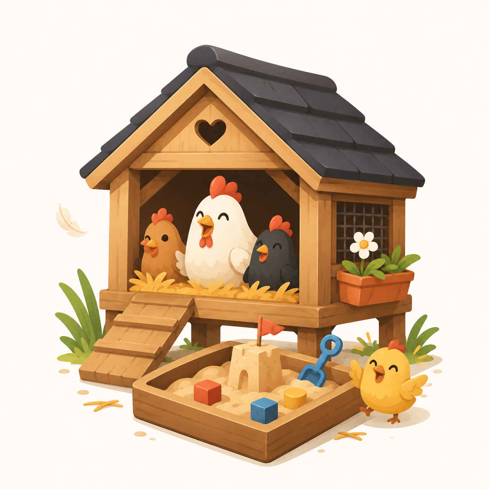

<div align="center">

# co:op



Run coding agents with their permission prompts off, in a sandbox that holds only your project.
Then give them a task queue and let them work through it overnight.

[](https://github.com/AndrewDryga/coop/actions/workflows/ci.yml)
[](https://github.com/AndrewDryga/coop/releases/latest)
[](https://goreportcard.com/report/github.com/AndrewDryga/coop)
[](LICENSE)

</div>

Coding agents do their best work unleashed, but that's a gamble with your secrets and your code.
co:op runs the agent in a container that sees one folder: your project, at its real path. Your SSH
keys, cloud logins and other repos aren't in it. The same box runs Claude Code, Codex, Gemini CLI
and Grok.

```bash
cd ~/code/your-repo && coop claude
```

The [website](https://coop.dryga.com) shows how it works, and the
[guide](https://coop.dryga.com/docs.html) walks through every feature.

## Why a box

Agents do what they read in code, docs and issues, even when an attacker wrote it. A comment hidden
in a README can tell your agent to post your SSH key in an issue. In the box there is no key to
post. A package the agent installs can try to send your `.env` to a stranger's server. In the box
`.env` is empty, and with filtered networking that server can't be reached.

Sometimes the agent just gets it wrong. An agent cleaning up can run `rm -rf tests/ plan/ ~/`. In
the box, that `~/` isn't your home folder, and your files aren't there.

## Install

```bash
curl -fsSL https://coop.dryga.com/install.sh | sh
```

The script downloads the `coop` binary for your system into `~/.local/bin`. It needs `curl`, `tar`,
and `sha256sum` or `shasum`. If a container runtime is available, it also builds the box image and
runs `coop doctor`. If not, install one and then run:

```bash
coop build --egress open && coop doctor
```

co:op runs on macOS and Linux with Docker. Online provider runs use Docker's private network
namespace to keep credentials outside the box. Apple's
[`container`](https://github.com/apple/container) remains available for raw open-network workloads,
not provider-brokered or filtered runs. co:op prefers Docker when both are present. The `coop` binary is static.

`coop update` updates the binary and rebuilds the box on a newer base image. Each release carries
the agent CLIs and ACP adapters it was tested with, so updating co:op updates them too. To build
from source, run `git clone https://github.com/AndrewDryga/coop && cd coop && make install`.

<a name="verifying-a-download"></a>
<details><summary>Verifying a download</summary>

The one-line command runs `install.sh` from the `main` branch, served by GitHub Pages at
coop.dryga.com. That trusts GitHub, the domain, and the current `main` branch. To trust GitHub
alone, fetch the same script from `https://raw.githubusercontent.com/AndrewDryga/coop/main/install.sh`.

The script then needs the release's `checksums.txt`, and checks the downloaded archive against it
with `sha256sum` or `shasum`. It stops if the checksum file or the tool is missing. When
[cosign](https://github.com/sigstore/cosign) is installed, the script also proves the checksum file
came from the release workflow for the exact tag you asked for. Every release since v2.2.2 ships
that signature bundle, so a missing bundle stops the install instead of falling back to the
checksum alone. Without cosign, the script says the signature wasn't checked.

To verify before you run any project code, download the release files by hand. Set `VER` and
`ASSET` for your platform, for example `VER=v8.1.0 ASSET=coop_8.1.0_darwin_arm64.tar.gz`:

```bash
base="https://github.com/AndrewDryga/coop/releases/download/$VER"
curl -fsSLO "$base/$ASSET"
curl -fsSLO "$base/checksums.txt"
curl -fsSLO "$base/checksums.txt.bundle"

# 1. checksums.txt is signed by the release workflow (keyless Sigstore):
cosign verify-blob checksums.txt \
  --bundle checksums.txt.bundle \
  --certificate-identity "https://github.com/AndrewDryga/coop/.github/workflows/release.yml@refs/tags/$VER" \
  --certificate-oidc-issuer https://token.actions.githubusercontent.com

# 2. the archive matches the now-trusted checksum (Linux: sha256sum -c -):
awk -v f="$ASSET" '$2==f{print $1"  "f}' checksums.txt | shasum -a 256 -c -
```
</details>

## Quickstart

```bash
coop login claude          # 1. sign in, once per account
cd ~/code/your-repo        # 2. any git repo
coop init                  # 3. set up the project: settings, task queue, hooks
coop claude                # 4. start the agent in the box
```

`coop init` sets up the task queue, hooks, shared instructions and skills, and the
selected [agent directories](docs/agents.md#instructions). It configures the agents you're signed
in to, so sign in first.

Each agent starts with its own "don't stop to ask" flag on (`--dangerously-skip-permissions`,
`--dangerously-bypass-approvals-and-sandbox`, `--yolo`). An agent that goes off the rails works on
the repo you gave it, which you can restore from Git, and the rest of your computer stays out of
reach. Anything after the agent's name goes to the agent, so `coop claude --continue` resumes
Claude's last session in the box. Codex is the exception: its `-p` picks a profile, so run a
one-shot prompt with `coop codex exec "…"`.

Other ways in:

```bash
coop codex                                    # the same box, with Codex
coop claude --peer codex --peer gemini        # read-only second opinions for hard calls
coop shell                                    # a shell in the box, to look around
coop run -- npm test                          # any command in the box
```

## What stays out of the box

- The box mounts one folder: your project. Your home folder, SSH keys, cloud logins and other repos
  aren't in it.
- Secret files like `.env` stay on your computer, and inside the box they're empty files.
  `coop check-secrets` finds secrets inside your other files, and `.coopignore` hides more paths.
- With filtered networking, the box reaches your AI provider and the domains you approve. Everything
  else is blocked, so your code can't go anywhere you haven't approved.
- Native history and settings belong to the current repository; other projects' conversations stay
  outside its provider homes. Provider credentials stay in host-only storage and a run-local broker.
- There are no Git credentials inside. The agent commits in your name, and you decide what leaves
  your computer.

`coop doctor` checks all of this against the real box on your computer. Read more in
[the guide](https://coop.dryga.com/docs.html#sandbox), [the box](docs/box.md) and
[networking](docs/networking.md).

## Hand off the work

### A task queue that works overnight

Each task is a folder in `.agent/tasks`, written so an agent can start without asking questions.
`coop loop` works through the queue on its own, with a fresh agent for every task. A final review
reopens unfinished work. A task that needs your decision waits for you, and the loop moves on.

```bash
coop tasks add "Add a /health endpoint" \
  --context "The load balancer needs a cheap liveness check." \
  --acceptance "GET /health returns 200 with {\"ok\":true}, and a test covers it." \
  --approach "Add the route beside the others, then a handler test." \
  --subtask "Route and handler" --subtask "Test"
coop loop claude
```

See [the loop](docs/loop.md).

### Forks

A fork gives an agent its own copy of your repo, so you can keep working in yours. You review the
fork like a pull request. When you merge it, co:op rebases it onto your branch and runs your checks
before your branch moves.

```bash
coop fork api codex --loop -d     # work the queue in a fork, in the background
coop fork review api --stat       # its commits and changed files
coop fork merge api               # rebase, run your checks, merge
```

See [forks](docs/forks.md).

### Accounts, models and presets

Sign in to more than one account, and a loop that hits a usage limit moves to the next account or
model and keeps going. Editor sessions switch the same way. You pick the model, effort and account
in the target, as in `coop claude:opus/xhigh@work`.

A preset is a team of models in one file: a lead, its fallbacks, and the roles it consults or hands
work to. `coop presets init` writes a starter team you can change, and `coop loop frontier` runs it.

See [agents, accounts and presets](docs/agents.md).

## Your project's tools and services

If your repo pins versions in `.tool-versions`, `coop init` builds them into the box's image. For
anything more, describe the image in `.agent/Dockerfile`. Postgres, Redis and anything else in your
Compose file run beside the box, each in its own container. With filtered networking they share a
private network with no direct internet. `coop up` starts them, `coop down` stops them and keeps their data, and
`coop down --delete-volumes` also deletes their data.

See [the box](docs/box.md).

## Editors, MCP and your own platform

Steer the sandboxed agent from Zed, or any editor that speaks ACP, with account rotation built in.
Define MCP servers once, outside your repo, and co:op makes them available to every supported
agent. You can also connect co:op workers to your own platform, which hands out the jobs. Models
never see your GitHub credentials.

See [editors, MCP and controllers](docs/integrations.md) and the [session API](docs/session-api.md).

## Evaluations

Evaluations show which model, preset or loop recipe works best on repeatable tasks. A separate
verifier grades each result, so the model never grades its own work. Start with a free preview,
which starts no container and spends nothing:

```bash
coop eval run core codex --timeout 35m --dry-run
```

See [evaluations](docs/evals.md).

## Documentation

- [The guide](https://coop.dryga.com/docs.html) covers every feature, start to finish.
- Reference pages: [the box](docs/box.md), [agents, accounts and presets](docs/agents.md),
  [forks](docs/forks.md), [the loop](docs/loop.md),
  [editors, MCP and controllers](docs/integrations.md), [evaluations](docs/evals.md),
  [configuration](docs/configuration.md), [networking](docs/networking.md),
  [the session API](docs/session-api.md), and [every command](docs/cli.md).
- Upgrading? Read [MIGRATING.md](MIGRATING.md) and the [changelog](CHANGELOG.md).
- The background, in two write-ups:
  [Running an AI coding agent you can't trust](https://dryga.com/blog/untrusted-ai-coding-agent/)
  (the sandbox) and [One brain, two agents](https://dryga.com/blog/os-for-coding-agents/) (the
  queue, the hooks and the loop that runs it unattended).

## Build and test

co:op is one static Go binary. `make install` builds it into `~/.local/bin`, and `make check` runs
the same gate CI runs. [CONTRIBUTING.md](CONTRIBUTING.md) covers the source layout and the test
layers.

## License

MIT. See [LICENSE](LICENSE).
